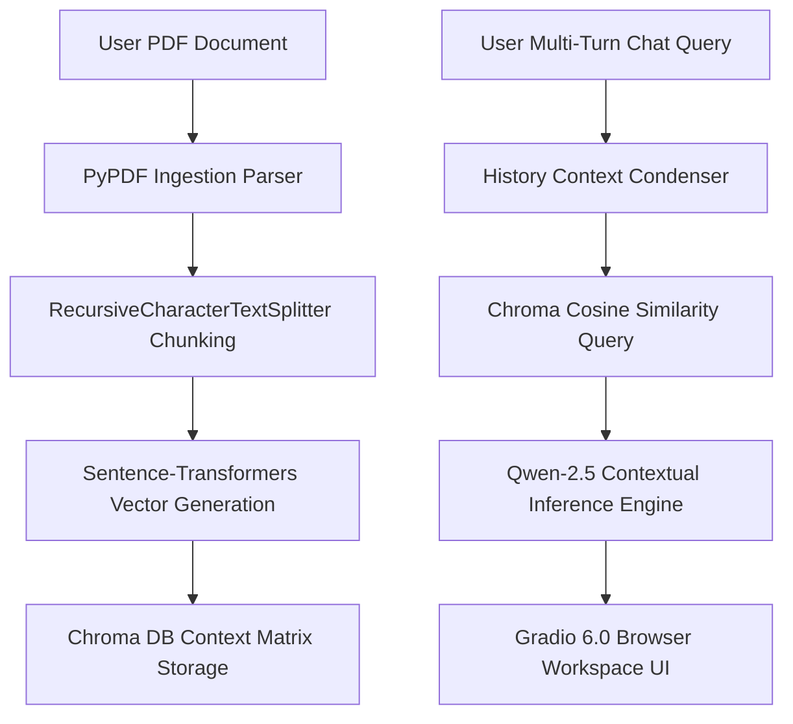

# 📚 PDF Chatbot Engine — Cloud-Native RAG Pipeline

An enterprise-ready, serverless Retrieval-Augmented Generation (RAG) system that transforms static PDF documents into interactive, context-aware knowledge bases. Built using LangChain Expression Language (LCEL), Chroma vector spaces, Qwen-2.5 language intelligence, and a web deployment layer driven by Gradio 6.0.

---

## 🚀 Interactive Live Space
🔗 **Test the full-screen deployment dashboard live on Hugging Face Spaces:** https://rchinmay91-pdf-chatbot.hf.space

---

## 🗺️ System Engineering Architecture
The system employs an end-to-end declarative pipeline mapping source files down to clean browser responses:



---

## ⚙️ Core Technical Capabilities

### 1. Document Extraction & Chunking Logic
* **Dynamic Content Extraction:** Source documents are parsed with structural verification using `PyPDFLoader`.
* **Granular Chunk Isolation:** Continuous data runs are segmented into text chunks of 1,000 characters with a 200-character overlapping safe boundary using a `RecursiveCharacterTextSplitter`. This layout ensures deep topical context remains intact across structural fragment lines.

### 2. High-Fidelity Vector Space Processing
* **Text Embeddings:** Text fragments are compiled into multi-dimensional float arrays using the cloud-managed `all-MiniLM-L6-v2` Sentence-Transformers platform.
* **Vector Array Ingestion:** Data arrays are indexed inside an active in-memory instance of `Chroma DB`.

### 3. State Management & Intent Stabilization (Gradio 6.0+)
* **Turn Identity Parsing:** The messaging loop hooks straight into current Gradio `ChatMessage` objects, explicitly splitting conversational records by filtering the `.role` and `.content` metadata targets.
* **Context Preservation:** Follow-up questions are dynamically re-routed into a text consolidation chain (`ChatPromptTemplate | llm`). This creates clear, standalone queries that understand context across active chats before triggering data retrievals.

---

## 🛠️ Repository Architecture

```text
├── app.py                # Main user interface application and LCEL pipeline architecture
├── requirements.txt      # Structural software dependency landscape requirements
├── .gitignore            # Security manifest blocking secret and cache tracking leakage
└── README.md             # Enterprise system documentation and architectural blueprint
```

---

## 📥 Local System Installation

### 1. Clone the project and step into the workspace directory:
```bash
git clone https://github.com/rchinmay91/pdf-chatbot.git
cd pdf-chatbot
```

### 2. Force install execution framework requirements:
```bash
pip install -r requirements.txt
```

### 3. Run the application script:
```bash
python app.py
```
Open `http://127.0.0.1:7860` inside your browser to interact with the model locally.

---

## 📜 License
This project is open-source software licensed under the terms of the MIT License.
