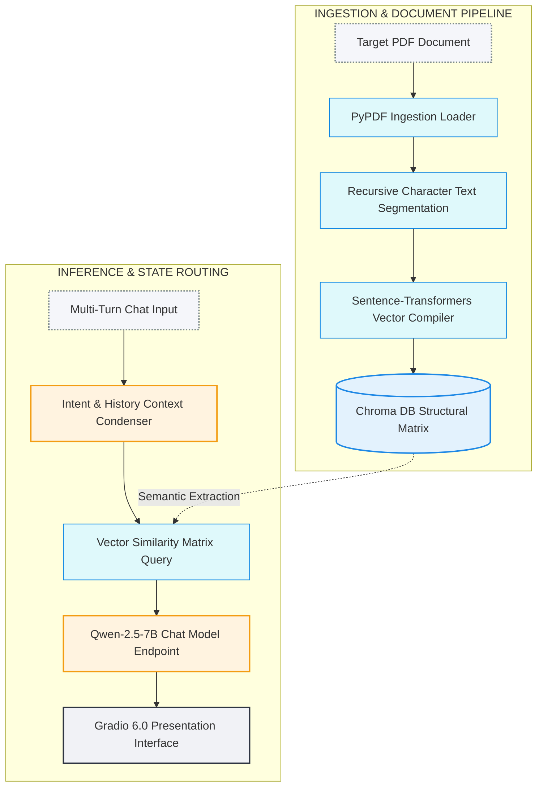

# 📚 PDF Chatbot — Premium Serverless RAG Pipeline

<p align="center">
  
  
  
  
  
  
</p>

An enterprise-ready, serverless **Retrieval-Augmented Generation (RAG)** application engineered to transform static PDF documentation into an interactive, context-aware knowledge network. This system eliminates local computational bottlenecks by decoupling front-end presentation from heavy AI operations, relying on a robust **LangChain Expression Language (LCEL)** pipeline, in-memory **Chroma** vector matrix indexing, and high-availability cloud-managed inference endpoints.

---

## 🚀 Live Production Space

Experience the full-screen interactive web application live on Hugging Face Spaces:
👉 **[Launch Production Interface](https://rchinmay91-pdf-chatbot.hf.space
)**

---

## 🗺️ System Engineering Topology

The dynamic flowchart below models the structured architecture of the system—detailing the explicit transactional flow from document extraction down to the stateful, conversational user tracking layer.



---

## ⚙️ Core Technical Capabilities & Implementation Details

### 🛡️ 1. Intelligent Document Parsing & Context-Preserving Chunking
* **Structural Extraction Pipeline:** Integrates `PyPDFLoader` to seamlessly ingest multi-page document layers, preserving layout data and textual coherence across page structures.
* **Recursive Safe Segmentation:** Text matrices are split into structured blocks via `RecursiveCharacterTextSplitter` configured with a **chunk size of 1,000 characters** and a **200-character overlapping safe boundary**. This dual-tiered boundary ensures critical topics do not suffer semantic fragmentation across rigid section markers.

### 🧠 2. High-Fidelity Vector Space Processing & Vector Indexing
* **Dense Coordinate Mapping:** Raw data strings are transformed into spatial floating-point representations using the `all-MiniLM-L6-v2` Sentence-Transformers platform.
* **Vector Array Registry:** Multi-dimensional coordinate mappings are securely cached inside an active, in-memory instance of `Chroma DB`, optimized for sub-second cosine similarity lookups during queries.

### 💬 3. Multi-Turn Conversation Memory Routing (Gradio 6.0+)
* **Object Traversal Safeguards:** Built to natively intercept contemporary Gradio `ChatMessage` objects, explicitly parsing conversation logs by targeting internal `.role` and `.content` properties to prevent data-unpacking crashes.
* **Query Contextualization:** Conversational history is passed through a pre-retrieval pipeline (`ChatPromptTemplate | llm`). This layer automatically rewrites short or implicit follow-up entries into rich standalone queries before searching the vector database.

---

## 📊 Infrastructure, Frameworks & Analytics Ecosystem

### 🌐 Hugging Face Spaces Deployment
* **Serverless Execution Architecture:** The backend relies entirely on Hugging Face Free CPU Basic container nodes (16GB RAM / 2 vCPUs), presenting zero local hosting overhead.
* **Secure Environment Secret Isolation:** Access tokens remain isolated via native Hugging Face **Space Secrets** configured under the exact variable `HUGGINGFACEHUB_API_TOKEN`. This parameter is systematically accessed via `os.getenv()` at initialization to strictly maintain infrastructure protection limits.
* **Model Endpoint Access:** Implements a direct API handshake to fetch remote models from Hugging Face's global serverless worker layer, guaranteeing instant execution cycles.

### 🎨 Gradio 6.0 Core Interface Integration
* **Asynchronous File Handling:** Employs `gr.File` for isolated document uploading, binding events directly to background processes while leaving the UI thread fully interactive.
* **Modern State Handlers:** Uses `gr.ChatInterface` to capture, track, and maintain multi-turn context objects natively, removing the need for manual connection pools or complex custom arrays.
* **Reactive Components:** Includes interactive state blocks (`gr.Textbox`) to communicate pipeline tracking stages and vector generation progress directly to the active browser interface.

### 🔬 Core Framework Library Matrix
The platform architecture utilizes clean, modern standalone abstractions to replace deprecated legacy tools:
* **`langchain-core`**: Drives the core LCEL compilation primitives (`|`) linking the contextual prompt maps to the inference pipeline.
* **`langchain-huggingface`**: Handles the explicit API transport mapping from the raw local input strings up to the cloud-native model workers.
* **`sentence-transformers`**: Processes deep mathematical text vectorization using the optimized `all-MiniLM-L6-v2` parameter pipeline.
* **`chromadb`**: Acts as the local similarity indexing matrix, matching natural queries to the nearest relevant document coordinates in real-time.

### 📈 Embedded Analytical Performance Tracking
The application embeds granular, rule-based analytics to capture systemic execution data:
* **Token Budget & Truncation Guardrails:** Configured with a `max_new_tokens=512` boundary limit to structure generation constraints and avoid timeout exceptions.
* **Context Ingestion Metrics:** Features a fixed spatial constraint (`search_kwargs={"k": 3}`) to limit the vector payload data sent during prompt synthesis, balancing extraction context with performance.
* **Deterministic Inference Monitoring:** Set to a steady `temperature=0.7` index point to stabilize generative variety and ensure responses remain factual to the uploaded document data.

---

## 🖼️ Application Workspace Preview

<p align="center">
  
</p>

| Module View | Interface Capabilities |
| :--- | :--- |
| **Document Ingestion Hub** | Single-click file processing pipeline equipped with real-time status feedback tracking logs. |
| **Conversational Matrix Space** | Streaming response panels optimized with multi-turn intent tracking using robust Gradio 6 standard tokens. |

---

## 🛠️ Repository File Landscape

```text
├── app.py                # Core interface definition & LangChain LCEL pipeline 
├── requirements.txt      # Structural software dependency landscape requirements
├── .gitignore            # Security rules blocking secret and cache tracking leakage
└── README.md             # Aesthetic architectural documentation 
```

---

## 📥 Local System Installation & Sandboxing

### 1. Clone the project and step into the workspace directory:
```bash
git clone https://github.com/rchinmay91/pdf-chatbot.git
cd pdf-chatbot
```

### 2. Enforce the installation of all framework system requirements:
```bash
pip install -r requirements.txt
```

### 3. Launch the local interface server:
```bash
python app.py
```
Open **`http://127.0.0.1:7860`** inside your web browser to interact with your local chatbot sandbox.

---

## 📜 Open Source License

Distributed under the terms of the MIT License.

```text
MIT License

Copyright (c) 2026 rchinmay91

Permission is hereby granted, free of charge, to any person obtaining a copy
of this software and associated documentation files (the "Software"), to deal
in the Software without restriction, including without limitation the rights
to use, copy, modify, merge, publish, distribute, sublicense, and/or sell
copies of the Software, and to permit persons to whom the Software is
furnished to do so, subject to the following conditions:

The above copyright notice and this permission notice shall be included in all
copies or substantial portions of the Software.

THE SOFTWARE IS PROVIDED "AS IS", WITHOUT WARRANTY OF ANY KIND, EXPRESS OR
IMPLIED, INCLUDING BUT NOT LIMITED TO THE WARRANTIES OF MERCHANTABILITY,
FITNESS FOR A PARTICULAR PURPOSE AND NONINFRINGEMENT. IN NO EVENT SHALL THE
AUTHORS OR COPYRIGHT HOLDERS BE LIABLE FOR ANY CLAIM, DAMAGES OR OTHER
LIABILITY, WHETHER IN AN ACTION OF CONTRACT, TORT OR OTHERWISE, ARISING FROM,
